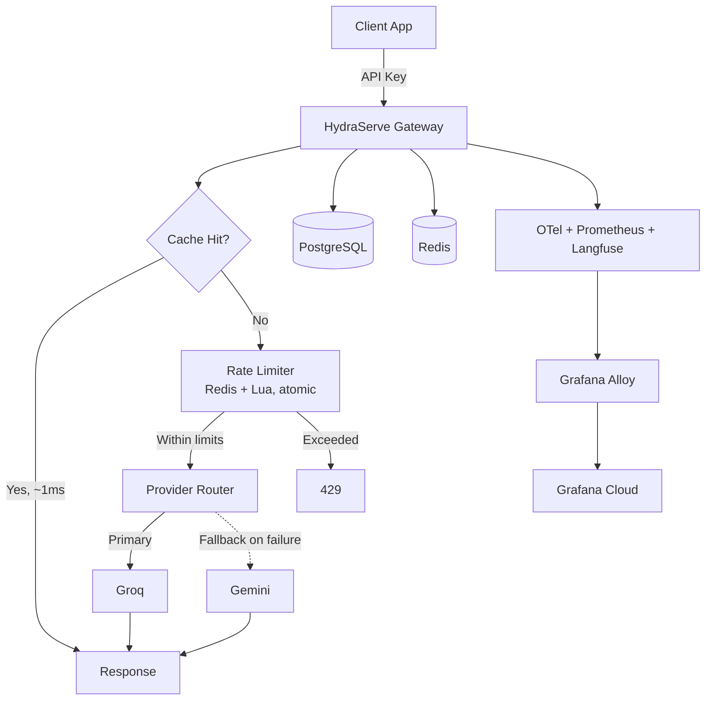

# 🌊 HydraServe

**A multi-provider LLM gateway — routing, rate limiting, caching, and observability, built from scratch.**

[]()
[]()
[]()
[](https://hydraserve.in)

**🔴 Live at [hydraserve.in](https://hydraserve.in)** — deployed on a single Oracle Cloud "Always Free" instance (1 OCPU / 6GB RAM).

---

## What it is

Calling an LLM provider directly works, until you need to track usage per customer, protect yourself from the provider's own rate limits, avoid paying twice for an identical prompt, or keep serving requests when a provider has an outage. HydraServe is a control-plane layer that sits between client applications and LLM providers (currently Groq and Gemini) and handles all of that centrally — authentication, dual-scope rate limiting, exact-match caching, automatic fallback, and full observability — so the calling application only ever talks to one API.

It's the same category of infrastructure as OpenRouter, Portkey, or TrueFoundry's AI Gateway: a pooled-key model where HydraServe holds the real provider credentials and issues its own scoped API keys to callers.

## Architecture



## Core Features

### Gateway
- **Unified endpoint** (`/chat`) routes to Groq or Gemini behind one API, with per-project scoped API keys (SHA-256 hashed at rest) and JWT auth for the management dashboard.
- **Automatic fallback** — a failed provider call retries 3x (via `tenacity`), then fails over to the secondary provider automatically, so a single provider outage doesn't take the gateway down.

### Rate Limiting
Redis-backed, atomic via a single Lua script, checking **two independent scopes** on every request:
- **Project-level** (`rpm`/`rpd`/`tpm`/`tpd`) — a business decision: how much a given project is allowed to use.
- **Model-level** (`global_rpm`/`global_rpd`/...) — the real upstream constraint each provider actually enforces.

Uses a sliding window (Redis sorted sets) for request counts, and a **reserve-then-correct** pattern for tokens: since nobody knows the exact token cost of a request until the provider replies, HydraServe reserves an estimate before the call and corrects it to the real count afterward.

### Caching
Exact-match caching (hash of prompt + model + system prompt + max tokens), gated to deterministic requests only (`temperature < 1`) on both the read and write path. Measured impact: **~3,700x latency reduction on a cache hit — 3.73s → 0.001s.**

Semantic caching (embeddings + vector search + cross-encoder re-ranking) was designed in depth and deliberately deferred — see [Known Limitations](#design-decisions-and-known-limitations).

### Observability
Three coordinated layers, each doing a different job:
- **Prometheus** — request/latency/cache/token/error counters and histograms, exposed at `/metrics`.
- **OpenTelemetry** — broad application tracing (FastAPI, SQLAlchemy, Redis, httpx auto-instrumentation + manual business spans), exported via a self-hosted **Grafana Alloy** collector to Grafana Cloud.
- **Langfuse** — scoped narrowly to LLM-specific spans (provider call → generation → fallback), because a generic tracer isn't the right tool for token-level LLM observability.

All three run in production against real traffic — see the live dashboard below.

## Screenshot


## Tech Stack

| Layer | Technology |
|---|---|
| API | FastAPI, Python 3.12, async/await throughout |
| Database | PostgreSQL, SQLAlchemy 2.0 (async), Alembic migrations |
| Cache & Rate Limiting | Redis, Lua scripting |
| LLM Providers | Groq, Google Gemini |
| Observability | Prometheus, OpenTelemetry, Grafana Alloy, Grafana Cloud, Langfuse |
| Frontend | React, TypeScript, Vite, Tailwind CSS, shadcn/ui, TanStack Query, Recharts |
| Auth | JWT (dashboard), SHA-256-hashed API keys (machine access) |
| Storage | AWS S3 (profile pictures), Resend (transactional email) |
| Deployment | Docker Compose (5 services), nginx, Let's Encrypt, Oracle Cloud |

## Getting Started

```bash
git clone https://github.com/sudhanshussd/hydraserve.git
cd hydraserve
cp .env.example .env   # fill in your own provider keys, DB creds, etc.
docker compose up -d --build
docker compose exec backend alembic upgrade head
```

The app is served behind nginx, which proxies `/api/*` to the FastAPI backend. Prometheus metrics are exposed at `/metrics`.

## Design Decisions and Known Limitations

Documented on purpose — every non-obvious choice here was a deliberate tradeoff, not an oversight:

- **Semantic caching was scoped out of v1.** Exact-match caching covers a meaningful share of duplicate traffic at near-zero complexity. Semantic caching needs embeddings, a vector index, and cross-encoder re-ranking to handle the negation problem correctly (a semantically "close" prompt can have the opposite intent) — designed, not yet built.
- **The provider registry is a hardcoded dict**, not a database table, since there are currently only two providers. It becomes a real table the moment a third is added.
- **The rate limiter accepts a small, deliberate race window on token limits under heavy concurrency** — in-flight requests aren't visible to each other's pre-call check. Accepted at current traffic; a reservation-lock scheme is the fix if it ever matters at scale.
- **Single-instance Postgres and Redis, no HA.** Appropriate for current load; the natural next step if traffic grows is managed, replicated instances rather than self-hosting further.
- **Load-tested atomicity is the next milestone, not a finished claim.** The rate limiter is designed to be atomic; proving it under real concurrent load — and pulling a real p95/p99 latency number from the same test — is next.

## Roadmap

- [ ] Concurrency and load testing (atomicity proof under real parallel load + p95/p99 latency)
- [ ] Semantic caching (embeddings + vector search)
- [ ] gRPC support for low-latency service-to-service calls

## License

MIT — see [LICENSE](./LICENSE).

---

Built by Sudh — [live demo](https://hydraserve.in) · [LinkedIn](#) · [GitHub](#)
